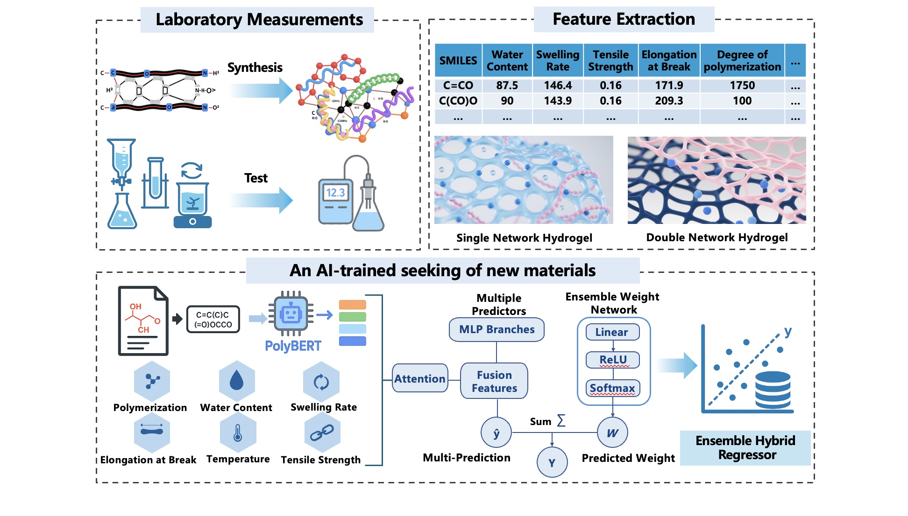

# PolyNet: 高分子体系性质数据驱动预测框架 (基于 polyBERT 的分子序列语义表示)



## 摘要 (Abstract)
PolyNet 面向高分子/水凝胶等软物质体系的结构–性质预测任务，结合预训练分子语言模型 polyBERT 的序列语义表示与实验可测宏观材料特征（含水率、溶胀率、聚合度、力学参数等），构建可扩展的融合回归体系。框架提供多种轻量模型头 (Light / Residual / Attention / Ensemble / CNN1D)，支持命令行训练与推理、批量预测及 Notebook 交互分析，适用于小样本到中等规模实验数据的快速建模和对比验证。

## 1. 设计动机
- 高分子材料结构多样且层级复杂，单纯基于经验或简单分子指纹难以充分表征。
- 预训练分子 Transformer (polyBERT) 能捕获序列层面的语义与局部环境模式。
- 实验材料特征（宏观/加工/形态/物性统计量）与分子级语义互补。
- 通过特征融合 + 多种可插拔回归头，实现不同复杂度下的性能–泛化折中。

## 2. 方法概述
1. SMILES 编码：采用 `kuelumbus/polyBERT`，分词 → Transformer 前向 → mean pooling 得到固定维度向量。
2. 材料特征处理：可选标准化（StandardScaler）。
3. 融合机制：材料特征投影到统一融合维度，与压缩后的 polyBERT 表征交互（注意力 / 拼接 / 残差）。
4. 模型头：
   - Light：紧凑 MLP
   - Residual：堆叠残差块
   - Attention：自注意力 + 特征重要性加权
   - Ensemble：多分支候选 + Softmax 权重聚合
   - CNN1D：融合后向量视作一维序列，经卷积与池化提取局部模式
5. 优化：均方误差 (MSE) 主损失，可报告 MAE / RMSE / R²。
6. 保存：模型权重 (state_dict) 与特征缩放器（feature_scaler.pkl，若启用标准化），附配置与训练曲线文件。

## 3. 目录结构 (示例)
```
polyNet/
  model_training.py
  model_prediction.py
  polyBERT.ipynb
  trained_models/
    attention_20C/
      model.pth
      feature_scaler.pkl
  datasets/
  requirements.txt
  README.md
```

## 4. 环境安装
```bash
python -m venv polyNet
source venv/bin/activate  
pip install -r requirements.txt
```

## 5. 数据格式规范
最少字段：
- SMILES: 分子结构
- 目标列: 如 Conductivity（可替换为所需物性：离子电导率、拉伸强度、介电常数等）
- 材料特征: 任意数值列（例：WaterContent, SwellingRate, Degreeofpolymerization, ElongationatBreak, TensileStrength）

CSV/Excel 行示例：
```
SMILES,WaterContent,SwellingRate,Degreeofpolymerization,ElongationatBreak,TensileStrength,Conductivity
C=CO,87.5,146.4,1750,171.9,0.16,0.012
C(CO)O,90.0,143.9,100,209.3,0.16,0.018
```


## 6. 训练命令行使用
最小示例（仅结构 + 目标）：
```bash
python model_training.py \
  --data_path datasets/20C_dataset.xlsx \
  --target_col Conductivity
```

完整示例：
```bash
python model_training.py \
  --data_path datasets/20C_dataset.xlsx \
  --target_col Conductivity \
  --features WaterContent,SwellingRate,Degreeofpolymerization,ElongationatBreak,TensileStrength \
  --model_type attention \
  --epochs 40 \
  --batch_size 2 \
  --lr 5e-4 \
  --weight_decay 1e-5 \
  --lr_step_size 50 \
  --lr_gamma 0.5 \
  --test_size 2 \
  --save_dir trained_models/attention_20C_run1 \
  --seed 42
```

参数说明：
| 参数 | 说明 |
|------|------|
| --data_path | 数据文件 (Excel/CSV) 路径 |
| --target_col | 目标属性列名 |
| --features | 逗号分隔材料数值特征列 |
| --model_type | light / residual / attention / ensemble / cnn1d |
| --epochs / --batch_size | 训练轮次 / 批大小 |
| --lr / --weight_decay | 学习率 / L2 正则 |
| --lr_step_size / --lr_gamma | 学习率调度 |
| --test_size | <1 表示比例; ≥1 表示固定测试样本数 |
| --no_normalize_features | 关闭材料特征标准化 |
| --save_dir | 模型输出目录 |
| --seed | 随机种子 |


## 7. 推理与部署
单条预测：
```bash
python model_prediction.py \
  --model trained_models/attention_20C_run1/model.pth \
  --smiles "C(=O)(O)C=C"
```

批量预测：
```bash
python model_prediction.py \
  --model trained_models/attention_20C_run1/model.pth \
  --csv datasets/new_samples.csv \
  --smiles_col SMILES \
  --output datasets/new_samples_predictions.csv
```

交互模式（逐条输入）：
```bash
python model_prediction.py -i
```

Notebook 使用示例：
```python
from model_prediction import ModelPredictor
predictor = ModelPredictor("trained_models/attention_20C_run1/model.pth")
y = predictor.predict_single(
    smiles="C(=O)(O)C=C",
    material_properties={
        "WaterContent": 89.3,
        "SwellingRate": 143.6,
        "Degreeofpolymerization": 1750,
        "ElongationatBreak": 190.7,
        "TensileStrength": 0.75
    }
)
print("Pred:", y)
```

批量：
```python
preds = predictor.predict_batch(
    smiles_list=["C=CO","C(CO)O"],
    material_properties_list=[
        {"WaterContent":87.5,"SwellingRate":146.4,"Degreeofpolymerization":1750,"ElongationatBreak":171.9,"TensileStrength":0.16},
        {"WaterContent":90.0,"SwellingRate":143.9,"Degreeofpolymerization":100,"ElongationatBreak":209.3,"TensileStrength":0.16}
    ]
)
```

## 8. 模型结构细节
| 组件 | 作用 |
|------|------|
| polyBERT Encoder | 预训练序列表示，捕获原子序列语义与局部环境 |
| Mean Pooling | Token 级表示 → 全局分子向量 |
| Feature Projector | 材料特征映射到融合维度 (线性层堆叠 + 激活 + Dropout) |
| Cross / Self Attention | 捕获多模态交互与内部相关性 |
| Ensemble Branches | 多子模型输出加权求和，缓解单模型方差 |
| CNN1D Head | 卷积抽取局部特征响应模式，提高非线性建模能力 |

可扩展方向：多任务目标、图结构特征融合、对比学习微调、参数高效微调（LoRA / Adapter）。


