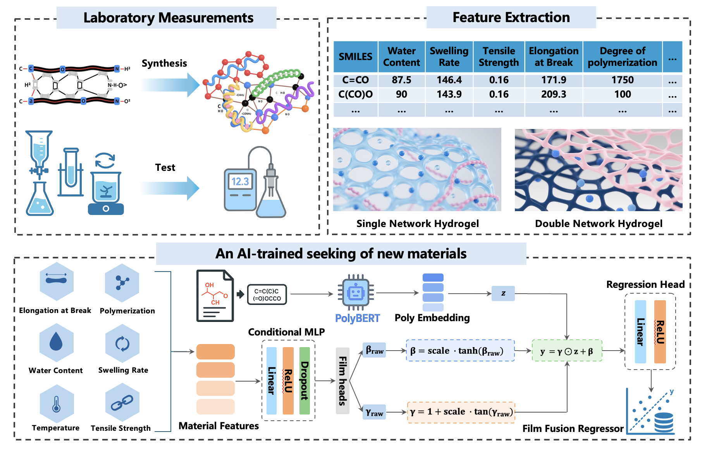

# polyNet: 基于 polyBERT + FiLM 的聚合物性质预测

polyNet 使用 HuggingFace 的 polyBERT（[`kuelumbus/polyBERT`](https://huggingface.co/kuelumbus/polyBERT)）对聚合物 SMILES 进行表征，并通过 FiLM 对材料表格特征进行条件调制，从而完成目标性质（如电导率）的回归预测。



## 特性 / Features
- 使用 FiLM 模型，当前采用 dense 的 FiLM head  
- 训练与推理均基于 polyBERT embedding  
- 终端一键训练与批量推理  

## 环境准备 / Environment Setup
```bash
python3 -m venv .venv
source .venv/bin/activate
pip install -r requirements.txt
```

可选：设置缓存目录（加速 polyBERT 首次下载）
```bash
export HF_HOME=./.cache/huggingface
export TRANSFORMERS_CACHE=./.cache/huggingface
export TORCH_HOME=./.cache/torch
```

## 数据准备 / Dataset Preparation
- **训练数据**：建议使用 Excel（.xlsx），包含：
  - 必需列：`SMILES`、目标列（如 `Conductivity`）
  - 可选特征列（示例）：`WaterContent`, `SwellingRate`, `Degreeofpolymerization`, `ElongationatBreak`, `TensileStrength`
- **推理数据**：CSV 文件，至少包含 `SMILES`；若训练时使用了特征列，则需在 CSV 中提供相同列名。  

目录示例：
```
datasets/
  └── dataset.xlsx
```

## 训练（终端） / Training
示例命令：
```bash
python3 TrainModel.py \
  --data_path datasets/20C_dataset.xlsx \
  --target_col Conductivity \
  --features WaterContent,SwellingRate,Degreeofpolymerization,ElongationatBreak,TensileStrength \
  --epochs 80 \
  --batch_size 2 \
  --lr 1e-3 \
  --weight_decay 1e-4 \
  --optimizer adamw \
  --loss smoothl1 \
  --lr_scheduler plateau \
  --plateau_patience 10 \
  --plateau_factor 0.6 \
  --plateau_min_lr 1e-5 \
  --clip_grad_norm 1.0 \
  --test_size 2 \
  --seed 42
```

训练输出示例：`trained_models/film_model/`
- `model.pth`（模型权重与信息）
- `results.json`（训练配置、指标）
- 可选可视化日志/图表

说明：
- 自动检测 GPU/CPU；首次运行会自动下载 polyBERT
- `--features` 次序需与数据列一致  

## 推理（终端） / Inference
批量预测 CSV：
```bash
python3 PredictModel.py \
  --model trained_models/film_model \
  --csv path/to/data.csv \
  --smiles_col SMILES \
  --out path/to/pred.csv
```

- `--model` 可给目录或直接指定 `model.pth`
- 输入 CSV 至少包含 `SMILES`；若训练时使用了特征列，需同名提供  
- 输出文件将新增预测列（默认名：`Predicted_Conductivity`）  

## 引用 / Citation

本项目基于 [polyBERT](https://huggingface.co/kuelumbus/polyBERT) 模型进行聚合物表征，并结合 FiLM 进行性质预测。  
在使用或引用本项目时，请同时引用 polyBERT 的原始工作以及 polyNet 本仓库。

### polyBERT 引用
- HuggingFace 模型仓库: [kuelumbus/polyBERT](https://huggingface.co/kuelumbus/polyBERT)  
- 相关论文:  
```
@article{kuenneth2023polybert,
  title   = {polyBERT: a chemical language model to enable fully machine-driven ultrafast polymer informatics},
  author  = {Kuenneth, Christopher and Ramprasad, Rampi},
  journal = {Nature Communications},
  volume  = {14},
  pages   = {4099},
  year    = {2023},
  doi     = {10.1038/s41467-023-39868-6},
  url     = {https://doi.org/10.1038/s41467-023-39868-6}
}
```

### polyNet 引用
如果您在研究中使用了 **polyNet**，请引用本仓库：
```
@misc{polyNet2025,
  title   = {polyNet: Polymer Property Prediction with polyBERT and FiLM},
  author  = {Your Name and Contributors},
  year    = {2025},
  note    = {GitHub repository},
  url     = {https://github.com/your-repo/polyNet}
}
```

## Citation 

This project is built upon [polyBERT](https://huggingface.co/kuelumbus/polyBERT) for polymer SMILES embedding, with FiLM-based conditioning for property prediction.  
If you use this repository in your work, please cite both **polyBERT** and **polyNet**:

### polyBERT
- HuggingFace model: [kuelumbus/polyBERT](https://huggingface.co/kuelumbus/polyBERT)  
- Reference paper:  
```
@article{kuenneth2023polybert,
  title   = {polyBERT: a chemical language model to enable fully machine-driven ultrafast polymer informatics},
  author  = {Kuenneth, Christopher and Ramprasad, Rampi},
  journal = {Nature Communications},
  volume  = {14},
  pages   = {4099},
  year    = {2023},
  doi     = {10.1038/s41467-023-39868-6},
  url     = {https://doi.org/10.1038/s41467-023-39868-6}
}
```

### polyNet
```
@misc{polyNet2025,
  title   = {polyNet: Polymer Property Prediction with polyBERT and FiLM},
  author  = {Your Name and Contributors},
  year    = {2025},
  note    = {GitHub repository},
  url     = {https://github.com/your-repo/polyNet}
}
```
